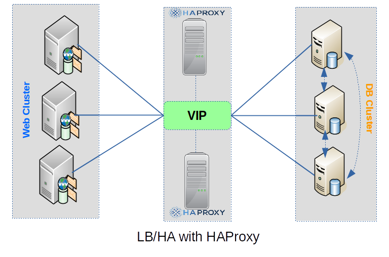

# HAProxy - HA/LB for TCP/HTTP applications

Một số nội dung về HAProxy, gồm:

- Cấu trúc [tệp cấu hình haproxy](docs/About-HAProxy-Configuration-File.md)

- Thuật toán [cân bằng tải trong HAProxy](docs/About-HAProxy-Load-Balancing.md)

- Cấu hình [HAProxy với SSL](docs/HAProxy-SSL.md)

- Cấu hình [High Availability cho Redis-Sentinel](docs/HAProxy-for-Redis-Sentinel.md)

- Một số [mẫu cấu hình haproxy LB/HA cho Web/DB](conf/)

Updating...
