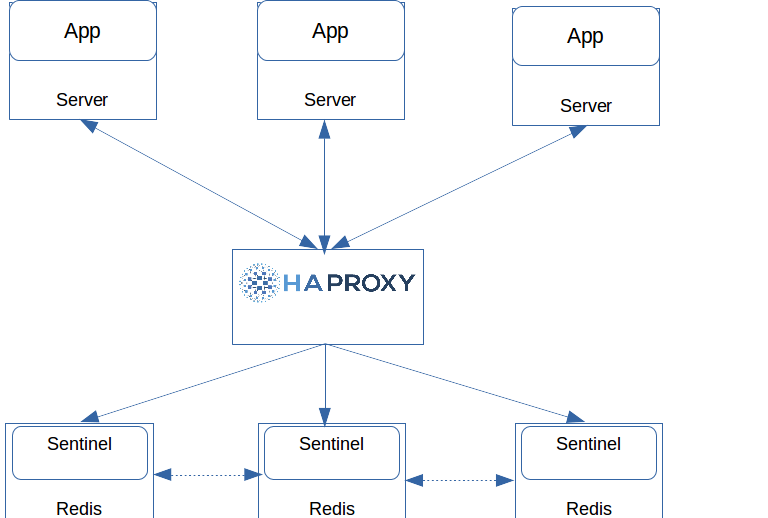

# HA Redis-Sentinel sử dụng HAProxy

Trong bài viết này chúng ta sẽ sử dụng HAProxy để cấu hình chạy HA cho redis sentinel

Mô hình thực hiện gồm:

- 01 server HAProxy có địa chỉ: 192.168.10.186

- 01 server HAProxy có địa chỉ: 192.168.10.186

- 03 redis server cấu hình cluster sử dụng sentinel, với địa chỉ IP là:

  - Redis master: 192.168.10.111

  - Redis slaves: 192.168.10.112 và 192.168.10.113

 

Thừa nhận đã cài đặt và cấu hình redis sentinel cho 03 redis server. Có thể tham khảo cài đặt sử dụng bash script sau: [Script for Install and configure Redis cluster + Sentinel](https://raw.githubusercontent.com/keepwalking86/redis-cluster-with-sentinel/master/install_redis.sh)

## Cấu hình HAProxy

Nếu HAProxy chỉ dành riêng cho phục vụ cho redis, chúng ta có thêm các phần sau trong phần proxy của tệp cấu hình haproxy.cfg

        defaults redis
                mode tcp
                timeout connect 10s
                timeout server 30s
                timeout client 30s
        frontend redis-in
                bind *:6380
                default_backend redis-backend
        backend redis-backend
                option tcp-check
                tcp-check connect
                tcp-check send PING\r\n
                tcp-check expect string +PONG
                tcp-check send info\ replication\r\n
                tcp-check expect string role:master
                tcp-check send QUIT\r\n
                tcp-check expect string +OK
                server redis1 192.168.10.111:6379 check inter 1s
                server redis2 192.168.10.112:6379 check inter 1s
                server redis3 192.168.10.113:6379 check inter 1s

Ở đây, chúng ta sẽ cấu hình phần proxy của HAProxy thành 3 phần: defaults, frontend và backend

- phần defaults: chúng ta sử dụng để thiết lập các thông số chung cho các phần còn lại. Trong đó, khai báo mode mà haproxy sẽ thực hiện là “tcp”. Các giá trị timeout ở đây là thiết lập time giữa nội bộ app, haproxy và redis, vì vậy tùy thuộc vào hiệu năng của server mà ta thiết lập timeout cho phù hợp.

- phần frontend: thiết lập thông tin IP và port 3680 sẽ gán cho HAProxy mà chấp nhận yêu cầu kết nối từ app. Cấu hình cho HAProxy sẽ pass mặc định đến phần backend redis

- phần backend: thiết lập nhóm redis server, sử dụng tcp-check (thực hiện tuần tự  tcp send/expect) để kiểm tra hoạt động và role của redis. Chỉ có redis master có quyền write, vì vậy chúng ta cấu hình chỉ thực hiện route đến redis master khi app yêu cầu kết nối. Tất nhiên chúng ta có thể cấu hình check hệ thống redis mà bỏ qua tcp-check giá trị master, khi đó nếu không có giá trị redis master nó vẫn có thể read được từ redis slave (nhưng sẽ xảy ra lỗi khi có yêu cầu write). Ví dụ:

        backend redis-backend
                option tcp-check
                tcp-check connect
                tcp-check send PING\r\n
                tcp-check expect string +PONG
                server redis1 192.168.10.111:6379 check inter 1s
                server redis2 192.168.10.112:6379 check inter 1s
                server redis3 192.168.10.113:6379 check inter 1s

Chúng ta có thể thiết lập cấu hình 3 phần trên (default, frontend, backend) vào một phần “listen” trong HAProxy. Thiết lập cấu hình như sau:

        listen redis
                bind *:6380
                mode tcp
                timeout connect  10s
                timeout server  30s
                timeout client  30s
                option tcp-check
                tcp-check send PING\r\n
                tcp-check expect string +PONG
                tcp-check send info\ replication\r\n
                tcp-check expect string role:master
                tcp-check send QUIT\r\n
                tcp-check expect string +OK
                server redis1 192.168.10.111:6379 check inter 1s
                server redis2 192.168.10.112:6379 check inter 1s
                server redis3 192.168.10.113:6379 check inter 1s

Khi đó chúng ta có tệp /etc/haproxy/haproxy.cfg đầy đủ như sau:

        # Global settings
        global
                pidfile     /var/run/haproxy.pid
                maxconn 10000
                user haproxy
                group haproxy
                daemon
                quite
                stats socket /var/lib/haproxy/stats
                log 127.0.0.1   local0
        ## Statistics settings
        listen statistics
                bind *:1986
                stats enable
                stats hide-version
                stats realm Haproxy\ Statistics
                stats uri /stats
                stats refresh 30s
                stats auth keepwalking86:ILoveVietnam$
        ## Redis HA
        listen redis
                bind *:6380
                mode tcp
                timeout connect  10s
                timeout server  30s
                timeout client  30s
                option tcp-check
                tcp-check send PING\r\n
                tcp-check expect string +PONG
                tcp-check send info\ replication\r\n
                tcp-check expect string role:master
                tcp-check send QUIT\r\n
                tcp-check expect string +OK
                server redis1 192.168.10.111:6379
                server redis2 192.168.10.112:6379
                server redis3 192.168.10.113:6379

Thực hiện start haproxy và tạo vòng lặp kiểm tra thông tin replication khi sử dụng HAProxy

`for i in {1..3}; do redis-cli -p 6380 info replication; done`

 

Ta thấy mỗi lần truy vấn đến 192.168.10.186 với port 3680, giá trị trả về cho role hiện tại là master và có 02 slave được connect.
